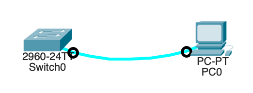

# Лабораторная работа 1. Базовая настройка коммутатора 
### Топология

### Таблица адресации
| Устройство  | Интерфейс |  IP-адрес / префикс  |  
|-------------|-----------|----------------------|
| S1          | VLAN1     | 192.168.1.2          | 
|             |           | 255.255.255.0        |
| PC-A        | NIC       | 192.168.1.10         | 
|             |           | 255.255.255.0        |
### Задачи:
#### Часть 1. Проверка конфигурации коммутатора по умолчанию
#### Часть 2. Создание сети и настройка основных параметров устройства
1. Настройте базовые параметры коммутатора.
2. Настройте IP-адрес для ПК.
#### Часть 3. Проверка сетевых подключений
1. Отобразите конфигурацию устройства.
2. Протестируйте сквозное соединение, отправив эхо-запрос.
3. Протестируйте возможности удаленного управления с помощью Telnet.
### Решение:
1. Создание сети и проверка настроек коммутатора по умолчанию
2. Настройка базовых параметров сетевых устройств
3. Проверка сетевых подключений
### Создание сети и проверка настроек коммутатора по умолчанию
#### 1. Создание сети согласно топологии


Почему нужно использовать консольное подключение для первоначальной настройки коммутатора? Почему нельзя подключиться к коммутатору через Telnet или SSH? *Так как устройство не имеет настроенных сетевых интерфейсов с завода. Подключение возможно только через консольный порт.*

#### 2. Проверка настроек коммутатора по умолчанию

```
Switch> enable
Switch# show running-config
```
Сколько интерфейсов FastEthernet имеется на коммутаторе 2960? *24*
Сколько интерфейсов Gigabit Ethernet имеется на коммутаторе 2960? *2*
Каков диапазон значений, отображаемых в vty-линиях? *0-4* *5-15*

```
Switch# show startup-config
startup-config is not present
```
Почему появляется это сообщение? *Так как устройство новое и на нем не было сохранено запускающей конфигурации*


