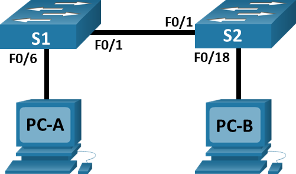
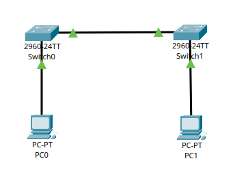
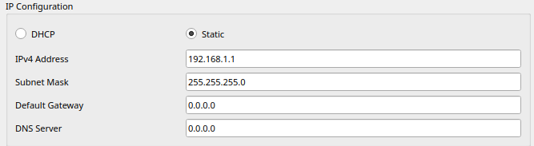

# Лабораторная работа 2. Просмотр таблицы MAC-адресов коммутатора 
### Топология

### Таблица адресации
| Устройство  | Интерфейс |  IP-адрес / префикс  |  
|-------------|-----------|----------------------|
| S1          | VLAN1     | 192.168.1.11         | 
|             |           | 255.255.255.0        |
| S2          | VLAN1     | 192.168.1.12         | 
|             |           | 255.255.255.0        |
| PC-A        | NIC       | 192.168.1.1          | 
|             |           | 255.255.255.0        |
| PC-B        | NIC       | 192.168.1.2          | 
|             |           | 255.255.255.0        |
## Задачи:
#### Часть 1. Создание и настройка сети
#### Часть 2. Изучение таблицы МАС-адресов коммутатора
## Решение:
### Часть 1. Создание и настройка сети
#### Шаг 1 подключить сеть в соответствии с топологией

#### Шаг 2 настройка узлов ПК

Для PC2. IPv4 Address 192.168.1.2/255.255.255.0
