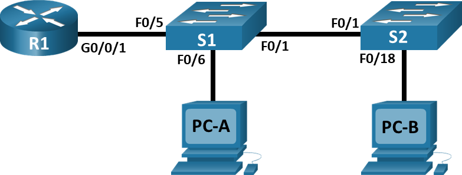
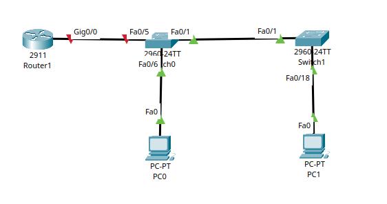
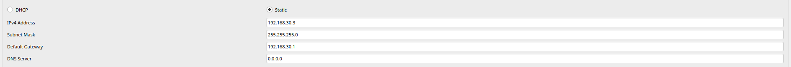

# Лабораторная работа 6. Внедрение маршрутизации между виртуальными локальными сетями 
### Топология


### Таблица адресации
| Устройство  | Интерфейс   |  IPv6-адрес          | Маска подсети.      | Шлюз по умолчанию |
|-------------|-------------|----------------------|---------------------|-------------------|
| R1          | G0/0/1.10   | 192.168.10.1         | 255.255.255.0       | -                 |
|             | G0/0/1.20   | 192.168.20.1         | 255.255.255.0       | -                 |
|             | G0/0/1.30   | 192.168.30.1         | 255.255.255.0       | -                 |
|             | G0/0/1.1000 | -                    | -                   | -                 |
| S1          | VLAN10      | 192.168.10.11        | 255.255.255.0       | 192.168.10.1      |
| S2          | VLAN10      | 192.168.10.12        | 255.255.255.0       | 192.168.10.1      | 
| PC-A        | NIC         | 192.168.20.3         | 255.255.255.0       | 192.168.20.1      |
| PC-B        | NIC         | 192.168.30.3         | 255.255.255.0       | 192.168.30.1      |


### Таблица VLAN

| VLAN        | Имя         |  Назначенный интерфейс | 
|-------------|-------------|------------------------|
| 10          | Управление  | S1: VLAN10 S2: VLAN10  | 
| 20          | Sales       | S1: F0/6               |  
| 30          | Opertions   | S2: F0/18              | 
| 999         | Parking_lot | С1: F0/2-4, F0/7-24, G0/1-2 С2: F0/2-17, F0/19-24, G0/1-2                      | 
| 1000        | Собственная | -                      | 

### Задачи:
#### Часть 1. Создание сети и настройка основных параметров устройства
#### Часть 2. Создание сетей VLAN и назначение портов коммутатора
#### Часть 3. Настройка транка 802.1Q между коммутаторами.
#### Часть 4. Настройка маршрутизации между сетями VLAN
#### Часть 5. Проверка, что маршрутизация между VLAN работает

### Решение:
#### Часть 1. Создание сети и настройка основных параметров устройства
#### Шаг 1. Создайте сеть согласно топологии


#### Шаг 2. Настройте базовые параметры для маршрутизатора
```
Router> enable
Router# conf t
Router(config)# hostname R1
R1(config)# no ip domain-lookup
R1(config)# enable secret class
R1(config)# line console 0
R1(config-line)# password cisco
R1(config-line)# login
R1(config-line)# exit
R1(config)# line vty 0 4
R1(config-line)# password cisco
R1(config-line)# login
R1(config-line)# exit
R1(config)# service password-encryption
R1(config)# banner motd # NO ENTER !!! #
R1(config)# exit
R1# clock set 14:30:00 28 Sep 2026
R1# write
```
#### Шаг 3. Настройте базовые параметры каждого коммутатора.
```
Switch> enable
Switch# conf t
Switch(config)# hostname S1
S1(config)# no ip domain-lookup
S1(config)# enable secret class
S1(config)# line console 0
S1(config-line)# password cisco
S1(config-line)# login
S1(config-line)# exit
S1(config)# line vty 0 4
S1(config-line)# password cisco
S1(config-line)# login
S1(config-line)# exit
S1(config)# service password-encryption
S1(config)# banner motd # NO ENTER !!! #
S1# clock set 14:30:00 28 Sep 2026
S1# write 
```
Аналогичная настройка для Switch2

#### Шаг 4. Настройте узлы ПК
Настройка узлов ПК выполнена согласно топологии:



#### Часть 2. Создание сетей VLAN и назначение портов коммутатора
#### Шаг 1. Создайте сети VLAN на коммутаторах.
#### a. Создайте и назовите необходимые VLAN на каждом коммутаторе из таблицы выше.
```
S1> enable
S1# configure terminal
S1(config)# vlan 10
S1(config-vlan)# name Upravlenie
S1(config-vlan)# exit
S1(config)# vlan 20
S1(config-vlan)# name Sales
S1(config-vlan)# exit
S1(config)# vlan 30
S1(config-vlan)# name Operations
S1(config-vlan)# exit
S1(config)# vlan 999
S1(config-vlan)# name Parking_Lot
S1(config-vlan)# exit
S1(config)# vlan 1000
S1(config-vlan)# name Sobstvennaya
S1(config-vlan)# exit

S1# show vlan brief
```
```
10   Upravlenie                       active    
20   Sales                            active    
30   Operations                       active    
999  Parking_Lot                      active    
1000 Sobstvennaya                     active    
```
Настройка Switch2 произведена идентично Switch1

#### b. Настройте интерфейс управления и шлюз по умолчанию на каждом коммутаторе, используя информацию об IP-адресе в таблице адресации. 

```
S1(config)# interface vlan 10
S1(config-if)# ip address 192.168.10.11 255.255.255.0
S1(config-if)# no shutdown
S1(config-if)# exit
S1(config)# ip default-gateway 192.168.10.1    
```
```
S2(config)# interface vlan 10
S2(config-if)# ip address 192.168.10.12 255.255.255.0
S2(config-if)# no shutdown
S2(config-if)# exit
S2(config)# ip default-gateway 192.168.10.1    
```
#### c. Назначьте все неиспользуемые порты коммутатора VLAN Parking_Lot, настройте их для статического режима доступа и административно деактивируйте их.

```
S1(config)# interface range f0/2-4, f0/7-24, g0/1-2
S1(config-if-range)# switchport mode access
S1(config-if-range)# switchport access vlan 999
S1(config-if-range)# shutdown
S1(config-if-range)# exit
```
```
S2(config)# interface range f0/2-17, f0/19-24, g0/1-2
S2(config-if-range)# switchport mode access
S2(config-if-range)# switchport access vlan 999
S2(config-if-range)# shutdown
S2(config-if-range)# exit
```
#### Шаг 2. Назначьте сети VLAN соответствующим интерфейсам коммутатора.

```
S1(config)# interface f0/6
S1(config-if)# switchport mode access
S1(config-if)# switchport access vlan 20
S1(config-if)# no shutdown
S1(config-if)# exit
S1# copy running-config startup-config
S1# show vlan brief
```
```
S2(config)# interface f0/18
S2(config-if)# switchport mode access
S2(config-if)# switchport access vlan 30
S2(config-if)# no shutdown
S2(config-if)# exit
S2# copy running-config startup-config
S2# show vlan brief
```
#### Часть 3. Конфигурация магистрального канала стандарта 802.1Q между коммутаторами
#### Шаг 1. Вручную настройте магистральный интерфейс F0/1 на коммутаторах S1 и S2.

```
S1(config)# interface f0/1
S1(config-if)# switchport mode trunk
S1(config-if)# switchport trunk native vlan 1000
S1(config-if)# switchport trunk allowed vlan 10,20,30,1000
S1(config)# no shutdown
```
Настройка на Switch2 выполнена идентично.
```
show interfaces trunk
```
#### Шаг 2. Вручную настройте магистральный интерфейс F0/5 на коммутаторе S1.

```
S1(config)# interface f0/5
S1(config-if)# switchport mode trunk
S1(config-if)# switchport trunk native vlan 1000
S1(config-if)# switchport trunk allowed vlan 10,20,30,1000
S1(config)# no shutdown
```
```
show interfaces trunk
```
